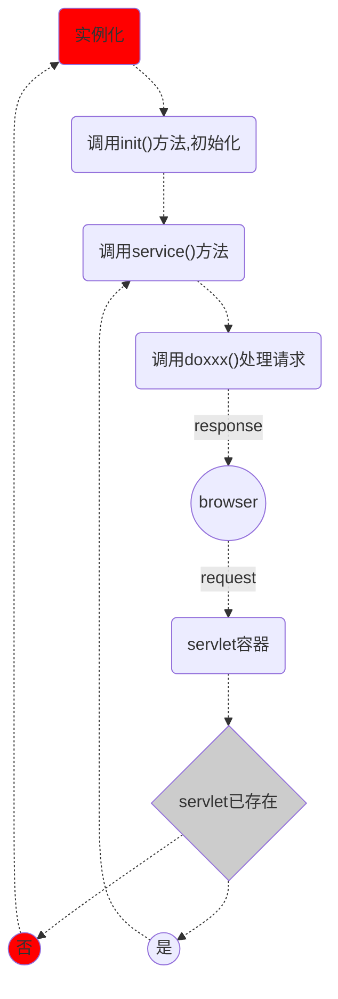
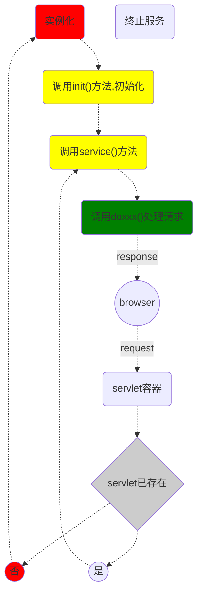

# javaWeb期末复习

### 软件架构

- C/S 架构   客户端/服务器
- B/S架构     浏览器/服务器
- 分层模式
- 主从模式
- 管道-过滤器模式
- 代理模式
- 端对端模式
- 事件总线模式
- MVC模式
- 解释器模式

### Web服务器有以下几种：

1. WebLogic        用于开发，集成，部署和管理大型分布式Web应用，网络应用，和数据库应用的java应用服务器
2. WebSphere     IBM公司开发，时一种功能完善，开放的Web应用程序服务器
3. Tomcat            是一个实现了JAVA EE 标准的最小的web服务器，由Apache，Sun 和其他一些公司和个人共同开发而成
4. IIS                    微软开发，具有一个完整的界面，方便用户管理的web服务器

## Servelet核心接口

### 1. ServletConfig接口

封装配置信息;Servlet 容器在初始化期间为每个 Servlet 创建`ServletConfig`对象，以将信息传递给 Servlet。此对象可用于从部署描述符文件（`web.xml`）获取配置信息，例如参数名称和值。

初始化servlet时创建**唯一**ServletConfig对象，通过Servlet的Init方法传递到Servlet对象中

   - getInitParameter(String param) :根据给定的初始化参数名称，返回参数值，若参数不存在则返回null 
   - getInitParameterNames()  返回一个Enumeration对象，里面包含了所有的初始化参数名称     
   - getServletContext()   返回当前ServletContext（）对象                              
   - getServletName()  返回当前Servlet的名字即@WebServlet的name属性值，如果没有配置该属性，返回Servlet类的权限定名。 

### 2. ServletContext继承接口

Servlet上下文代表当前的servlet的运行环境，是servlet与servlet容器之间直接通信的接口    ，唯一，内容该容器中的servlet共享

**getServletContext();**

- 获取应用初始化参数
  - getInitParameter(String name);
  - getInitParameterNames();
- 存取应用域数据
  - setAttribute(String name,Object object);
  - getAttribute(String name);
  - getAttributeNames();
  - removeAttribute(String name);
- 获取应用信息
  - getContextPath();
  - getServletName();
  - getRequestDispatcher(String path)    :返回一个用于向其他Web组件转发请求的RequestDispatcher对象；
  - getContext(String uripath) :根据uripath 返回其他web应用中的ServletContext（）对象，必须是“/“打头的绝对路径
- 获取容器信息
  - getServletInfo（）
  - getMajaroVersion（）  返回api主版本号
  - getMinotVersion（）   返回api次版本号
  - log（）用于记录一般日志
  - log（String message，Throwable throw） 记录异常的堆栈日志。
- 获取服务器文件资源
  - getResourceAsStream（String path）返回参数指定的输入流，参数路径必须”/"打头
  - getResource(String path) 返回指定的路径的URL对象
  - getRealPath（String path）; 返回path的真实路径。
  - getMineType（String file） 返回文件的类型

### HttpServletReques继承接口

封装请求的信息；对象由Servlet容器在用户每次请求servlet时被创建并传入Servlet的service（）方法中。

- 获取请求报文信息

  - 获取请求行

    getMethod（）；

    getRequestURI（）；

    getProtocol（）；

    getQueryString（）  ：获取查询字符串

    getServletPath（）；

    getContextPath（）；

  - 获取请求头

    - getIntHeader（）
    - getDateHeader（）
    - 。。。

  - 获取请求正文

    -  getParameter（String name）：获取用户指定的请求参数值
    -  。。。

- 获取网络连接的信息

- 存取请求域属性的方法

  - **setAttribute（String name，Object value）；**
  - gteAttribute（String name）；
  - removeAttribute（String name）

### HttpServletResponse继承接口.

封装响应的信息;

- 设置响应状态

  - **状态码**

    ```text
    1**     服务器收到请求，需要请求者据需执行操作
    2**     已成功被服务器接收理解并接受
    3**     需要客户端采取进一步的操作才能完成请求，通常用于重定向
    4**     表示客户端错误
    5**     服务器错误
    ```

  - setStatus(int sc)

  - setError(int sc)

  - sendError(int sc,String msg)

  - sendRedirect(String location)  

- 构建响应头

  - 响应消息头：
    - Server 
    - Content-Type
    - Transfer-Encoding
    - Date
    - Content-Encoding
    - Content-Length
    - Expires
    - Refresh
    - Cashe-Contro;
    - Last-Modified
    - Location
    - Content-Disposition
    - Set-Cookie
    - WWW-Authenticate

- 创建响应正文

  - getWriter()
  - getOutputStream()
  - 指定字符集编码：

  ```java
  response.setCharacterEncoding("utf-8");   // PrintWriter的编码方式
  response.setContentType("text/html;charset=UTF-8"); //定义发送的格式，和解析的格式
  response.setLocale(new java.util.Locale("zh", "CN")); //PrintWriter的编码方式
  ```

### 文件表单的属性multipart/form-data

| 值                                | 描述                                                         |
| --------------------------------- | ------------------------------------------------------------ |
| application/x-www-form-urlencoded | 在发送前编码所有字符（默认）                                 |
| multipart/form-data               | 不对字符编码。 在使用包含文件上传控件的表单时，必须使用该值。 |
| text/plain                        | 空格转换为 "+" 加号，但不对特殊字符编码。                    |

###  Form content types

The [ enctype](https://www.w3.org/TR/html401/interact/forms.html#adef-enctype) attribute of the [FORM](https://www.w3.org/TR/html401/interact/forms.html#edef-FORM) element specifies the [content type](https://www.w3.org/TR/html401/types.html#type-content-type) used to encode the [form data set](https://www.w3.org/TR/html401/interact/forms.html#form-data-set) for submission to the server. User agents must support the content types listed below. Behavior for other content types is unspecified.getQueryString（） 

Please alsgetQueryString（） o consult the section on [escaping ampersands in URI attribute values](https://www.w3.org/TR/html401/appendix/notes.html#ampersands-in-uris).

####  application/x-www-forgetQueryString（） m-urlencoded  

This is the default content type. Forms submitted with this content type must be encoded as follows:

1. Control names and values are escaped. Space characters are replaced by `+', and then reserved characters are escaped as described in [ [RFC1738\]](https://www.w3.org/TR/html401/references.html#ref-RFC1738), section 2.2: Non-alphanumeric characters are replaced by  `%HH', a percent sign and two hexadecimal digits representing the ASCII code of the character. Line breaks are represented as "CR LF" pairs (i.e., `%0D%0A').
2. The control names/values are listed in the order they appear in the document. The name is separated from the value by `=' angetQueryString（） d name/value pairs are separated from each other by `&'.

####  multipart/form-data  


multipart/form-data


***Note.** Please consult [[RFC2388\]](https://www.w3.org/TR/html401/references.html#ref-RFC2388) for additional information about file uploads, including backwards compatibility issues, the relationship between "multipart/form-data" and other content types, performance issues, etc.*

*Please consult the appendix for information about [security issues for forms](https://www.w3.org/TR/html401/appendix/notes.html#forms-security).*

The content type "application/x-www-form-urlencoded" is **inefficient** for sending l**arge quantities of binary data or text containing non-ASCII characters**. The content type "multipart/form-data" should be used for **submitting forms that contain files, non-ASCII data, and binary data**.

The content "multipart/form-data" follows the rules of all multipart MIME data streams as outlined in [[RFC2045\]](https://www.w3.org/TR/html401/references.html#ref-RFC2045). The definition of "multipart/form-data" is available at the [[IANA\]](https://www.w3.org/TR/html401/references.html#ref-IANA) registry.

A "multipart/form-data" message contains a series of parts, each representing a [successful control](https://www.w3.org/TR/html401/interact/forms.html#successful-controls). The parts are sent to the processing agent in the same order the corresponding controls appear in the document stream. Part boundaries should not occur in any of the data; how this is done lies outside the scope of this specification.

As with all multipart MIME types, each part has an optional "Content-Type" header that defaults to "text/plain". User agents should supply the "Content-Type" header, accompanied by a "charset" parameter.

### HttpSession 设置key value的方

getQueryString（） 

```java
HttpSession session=req.getSession();     //得到session对象
if(session.getAttribute(username)==null)       //用户本次session周期首次登录
	session.setAttribute(username,ud.getUser(username));  //放值入session
```

**Session基于Cookie**

**Cookie** ：HTTP 协议是无状态的，也就是说客户端和服务器端不需要建立持久的连接。由于客户端和服务器端的连接是基于一种请求应答模式，即客户端和服务器建立一个连接-客户端提交一个请求-服务器端收到请求后返回一个响应，然后二者就断开连接。

若客户端和服务器在完成一次请求以后就断开了连接，二者之间就不再有任何关系了；那么，当用户在页面1进行了登录后跳转到了同一个 Web  应用的页面2时，如何在页面2知道用户已经进行了登录呢？亦即当客户端再次发起请求的时候，服务器端如何判断两次不同的请求来自同一个客户端呢？

HTTP 协议下，服务器是无法区分每一次请求之间的联系的。要判断这种联系就需要有一个状态来标识每一次请求，如果两次请求的状态标识是一样的，这就表明这两个请求是从同一个客户端发起的。

Cookie 就是这样一个用来标识每一次请求的状态位。经过多年的发展 Cookie 变得越来越规范，后来直接成为了一个通用标准。

```java
cookie
    新建cookie：Cookie cookie=new Cookie（）；
    response.addCookie(cookie);
    设置有效期：cookie.setMaxAge（n*24*60*60);
```

常常听到这样一种误解“只要关闭浏览器，session就消失了”。其实可以想象一下会员卡的例子，除非顾客主动对店家提出销卡，否则店家绝对不会轻易删除顾客的资料。对session来说也是一样的，除非程序通知服务器删除一个session，否则服务器会一直保留，程序一般都是在用户做log off的时候发个指令去删除session。然而浏览器从来不会主动在关闭之前通知服务器它将要关闭，因此服务器根本不会有机会知道浏览器已经关闭，之所以会有这种错觉，是大部分session机制都使用会话cookie来保存session id，而关闭浏览器后这个session id就消失了，再次连接服务器时也就无法找到原来的session。如果服务器设置的cookie被保存到硬盘上，或者使用某种手段改写浏览器发出的HTTP请求头，把原来的session id发送给服务器，则再次打开浏览器仍然能够找到原来的session。

### 通过web.xml设置会话的最大不活动时间单位为_

```xml
在web.xml中配置session的有效时间： 
<session-config> 
<session-timeout>15</session-timeout> 
</session-config>
```

### “jsessionid”

用来标识一个session对象,大部分session机制都使用会话cookie来保存session id，而关闭浏览器后这个session id就消失了，再次连接服务器时也就无法找到原来的session。如果服务器设置的cookie被保存到硬盘上，或者使用某种手段改写浏览器发出的HTTP请求头，把原来的session id发送给服务器，则再次打开浏览器仍然能够找到原来的session。

### JSP有?种类型的元素

JSP有三种类型的元素：**指令元素**（directive element）、**行为元素**（action element）、和**脚本元素**（script element）。

<%@ page...%>  定义了独立于页面的属性，例如会话跟踪、错误处理页面、对缓存的要求等
<%@ include...>  在翻译阶段引入文件
<%@ taglib...>   声明一个在页面中使用的包含自定义行为的标记库
标准行为元素：
<jsp:usebean>  使一个JavaBeans在当前页面可用  
<jsp:getProperty>  从JavaBeans中获得某个属性值，并将其添加到应答中
<jsp:setProperty>  设置JavaBeans的属性值
<jsp:include>  在请求处理阶段引入来自一个servlet或页面的应答结果
<jsp:forward>  将对请求的处理转交给一个servlet或JSP页面
<jsp:param>  使用<jsp:forward> 或<jsp:include> 时，向这个请求添加参数
<jsp:plugin>
自定义行为元素和标准标记库：JSTL，JSP标准标记库（JSP Standard Tag Library），可以用扩展API开发自定义行为
脚本元素：
<%...%>  小脚本，用于嵌入脚本代码
<%=...%>  用于嵌入JAVA表达式
<%!...%>  声明变量和方法

### JSP注释

1.JSP页面中的HTML注释。 

  <!-- 注释内容 --> 

2.JSP页面中的普通注释。 

<% // 注释内容 %>  <% /* 注释内容 */ %> 

3.JSP页面中的隐藏注释。 

<%--”和“--%>

### setCharactersEncoding


```java
response.setCharacterEncoding("utf-8");   // PrintWriter的编码方式
response.setContentType("text/html;charset=UTF-8"); //定义发送的格式，和解析的格式
response.setLocale(new java.util.Locale("zh", "CN")); //PrintWriter的编码方式
```

### JavaBean可分为两种

JavaBean 是一种JAVA语言写成的可重用组件。为写成JavaBean，类必须是具体的和公共的，并且具有无参数的[构造器](https://baike.baidu.com/item/构造器/9844976)。JavaBean 通过提供符合一致性设计模式的公共方法将内部域暴露成员属性，set和get方法获取。众所周知，属性名称符合这种模式，其他Java 类可以通过自省机制(反射机制)发现和操作这些JavaBean 的属性。

JavaBean可分为**两种**：一种是**有用户界面**（UI，User Interface）的JavaBean；还有一种是**没有用户界面**，主要负责处理事务（如数据运算，操纵数据库）的JavaBean。JSP通常访问的是后一种JavaBean。

### EL（Expression Language，表达式语言）

EL（Expression Language） 是为了使JSP写起来更加简单。表达式语言的灵感来自于 ECMAScript 和 XPath 表达式语言，它提供了在 JSP 中简化表达式的方法，让Jsp的代码更加简化。

**简化操作**

Tomcat7开始，EL不仅支持属性访问，还支持使用方法


### JSTL函数库用于循环遍历标签

```jsp
<c:if test="${empty notes}">
	无笔记存储
</c:if>
<c:forEach items="${notes}" varStatus="i" var="item">
   	<a class="item">      
        <div class="line"></div>      
        <div class="dot"></div>      
        <div class="box">         
        	<div class="cbox">            
        		<div class="title">${item.title}</div>            
        		<div class="date">${item.description}</div>            
       			 <div class="data"><span>${item.createTime}</span></div> 
            </div>     
       </div>   
    </a>   
    <div class="activeLine"></div>
</c:forEach>
```

### doFilter方法

```java
package Note_MS.Control;
import Note_MS.bean.Note;
import Note_MS.bean.User;
import Note_MS.dao.NoteDao;
import javax.servlet.*;
import javax.servlet.annotation.WebFilter;
import javax.servlet.http.HttpServletRequest;
import javax.servlet.http.HttpServletResponse;
import javax.servlet.http.HttpSession;
import java.io.IOException;
import java.util.Date;

public class UserFliter implements Filter {

    @Override
    public void doFilter(ServletRequest servletRequest, ServletResponse servletResponse, FilterChain filterChain) throws IOException, ServletException {
        System.out.println(servletRequest.getParameter("user")+" 进入UserFliter [" +new Date()+"]");
        servletRequest.setCharacterEncoding("utf-8");
        servletResponse.setContentType("text/html;charset=utf-8");

        HttpServletRequest request = (HttpServletRequest) servletRequest;
        HttpServletResponse resp=(HttpServletResponse) servletResponse;

        HttpSession session = request.getSession();
        String username=request.getParameter("user");   //获取当前试图请求数据的用户
        System.out.println("UserName "+username);
        User _user = (User) session.getAttribute(username);   //用户登录后保存的用户状态
        System.out.println((User) session.getAttribute(username));

        if(_user==null) {  //如果不是当前登录用户的请求,,,将被抛弃
            System.out.println("UserFliter ERROR ["+username+"不被允许访问] [" +new Date()+"]");  //可以加入日志
            resp.sendRedirect(request.getContextPath() + "/not_permit.html");
        }
        else {
            System.out.println("UserFliter OK ["+username+" 放行] [" +new Date()+"]");
            filterChain.doFilter(servletRequest,servletResponse);
        }
    }
}
```


### Model 2模式
 Web 开发模式：Model 1 与 Model 2(MVC)

#### Model 1 

完全使用 JSP 来处理页面显示、业务处理和持久层操作是可以完成动态 web 应用的开发的，但这种方式因为分工不明确，只能适用于小型项目且后期很难维护。后来又可以使用 JSP + JavaBean 来进行开发，JSP 仅用来做页面显示和部分逻辑处理，将大部分的操作全部放在 JavaBean 中去处理，JSP 页面通过 JSP 动作来使用 JavaBean 。这种方式代码可复用性高，但是没有流程控制，仍然不足以开发大型项目。


#### Model 2

MVC 设计模式分为 Model(模型层) 、View(视图层) 和 Controller(控制层) 。在 Servlet 和 JSP 组成的 MVC 设计模式中， Servlet 作为控制层，负责接收用户的请求数据，调用模型层进行验证，最终将返回结果转给 JSP 作为展示，Model 就是具体独立的业务操作组件，一般都是以 JavaBean 方式存在的。


### jQuery

jQuery是一个快速、简洁的JavaScript框架，是继Prototype之后又一个优秀的JavaScript代码库（*或JavaScript框架*）。

jQuery设计的宗旨是“write Less，Do More”，即倡导写更少的代码，做更多的事情。它封装JavaScript常用的功能代码，提供一种简便的JavaScript设计模式，优化HTML文档操作、事件处理、动画设计和Ajax交互。

**简化js代码**

### 动态网站的特征

(1)动态网页一般以**数据库技**术为基础，可以大大降低网站维护的工作量；

(2)采用动态网页技术的网站可以**实现更多的功能**，如用户注册、用户登录、在线调查、用户管理、订单管理等等；

(3)动态网页实际上**并不是独立存在于服务器上的网页文件，只有当用户请求时服务器才返回一个完整的网页**；

(4)动态网页中的“?”对搜索引擎检索存在一定的问题，搜索引擎一般不可能从一个网站的数据库中访问全部网页，或者出于技术方面的考虑，搜索之中不去抓取网址中“?”后面的内容，因此采用动态网页的网站在进行搜索引擎推广时需要做一定的技术处理才能适应搜索引擎的要求。

### 动态网站技术

#### 常用的4种动态网页技术

1、PHP 即Hypertext Preprocessor（[超文本](https://baike.baidu.com/item/超文本)预处理器），它是当今Internet上最为火热的脚本语言，其语法借鉴了C、Java、[PERL](https://baike.baidu.com/item/PERL)等语言，但只需要很少的编程知识你就能使用PHP建立一个真正交互的Web站点。

它与HTML语言具有非常好的兼容性，使用者可以直接在脚本代码中加入HTML标签，或者在HTML标签中加入脚本代码从而更好地实现页面控制。PHP提供了标准的[数据库接口](https://baike.baidu.com/item/数据库接口)，数据库连接方便，兼容性强；扩展性强；可以进行[面向对象编程](https://baike.baidu.com/item/面向对象编程)。 [1] 

2、ASP 即Active Server Pages（活跃服务器页），它是微软开发的一种类似[超文本标识语言](https://baike.baidu.com/item/超文本标识语言)(HTML)、脚本(Script)与CGI([公用网关接口](https://baike.baidu.com/item/公用网关接口))的结合体，它没有提供自己专门的编程语言，而是允许用户使用许多已有的[脚本语言](https://baike.baidu.com/item/脚本语言)编写ASP的应用程序。ASP的程序编制比HTML更方便且更有灵活性。它是在Web服务器端运行，运行后再将运行结果以HTML格式传送至客户端的浏览器。因此ASP与一般的脚本语言相比，要安全得多。

ASP的最大好处是可以包含HTML标签，也可以直接存取数据库及使用无限扩充的[ActiveX控件](https://baike.baidu.com/item/ActiveX控件)，因此在程序编制上要比HTML方便而且更富有灵活性。通过使用ASP的组件和对象技术，用户可以直接使用ActiveX控件，调用对象方法和属性，以简单的方式实现强大的交互功能。 [1] 

但ASP技术也非完美无缺，由于它基本上是局限于微软的操作系统平台之上，主要工作环境是微软的IIS应用程序结构，又因ActiveX对象具有平台特性，所以ASP技术不能很容易地实现在跨平台Web服务器上工作。

aspx是微软的在[服务器](https://baike.baidu.com/item/服务器)端运行的动态网页文件，通过IIS解析执行后可以得到[动态页面](https://baike.baidu.com/item/动态页面)，是微软推出的一种新的[网络编程](https://baike.baidu.com/item/网络编程)方法，而不是asp的简单升级，因为它的编程方法和asp有很大的不同，他是在服务器端靠服务器[编译执行](https://baike.baidu.com/item/编译执行)的程序代码，　ASP 使用脚本语言，每次请求的时候，服务器调用脚本解析引擎来解析执行其中的程序代码，而asp.net 则可以使用多种语言编写，而且是全编译执行的，比ASP 快，而且，不仅仅是快的问题，有很多优点。 [1] 

3、JSP 即Java Server Pages（爪哇服务器页面），它是由Sun Microsystem公司于1999年6月推出的新技术，是基于Java Servlet以及整个Java（爪哇）体系的[Web开发技术](https://baike.baidu.com/item/Web开发技术)。 [1] 

JSP和ASP在技术方面有许多相似之处，不过两者来源于不同的技术规范组织，以至 ASP一般只应用于Windows  NT/2000平台，而JSP则可以在85%以上的服务器上运行，而且基于JSP技术的应用程序比基于ASP的应用程序易于维护和管理，所以被许多人认为是未来最有发展前途的[动态网站](https://baike.baidu.com/item/动态网站)技术。

4、CGI（Common Gateway Interface，公用网关接口）是较早用来建立动态网页的技术。当客户端向Web服务器上指定的CGI程序发出请求时，Web服务器会启动一个新的进程执行某些CGI程序，程序执行后将结果以网页的形式再发送回客户端。
　　CGI的优点是它可以用很多语言编写，如 C 、C++ 、VB和Perl语言。在语言的选择上有很大的灵活性。最常用的CGI开发语言为Perl。

### 是Java Web应用优势

- 增强模块化的轻量级容器
- 可以跨各种平台进行部署
- 灵活的依赖注入使用
- 包括XML，Java和注释配置的三路配置
- 通过POJO's缓解了注射测试的数据（普通JavaBeans）

### Tomcat的安装目录下各子目录的功能    

```text
/usr/local/tomcat 主目录(安装目录)

bin 存放windows或linux平台上启动或关闭的Tomcat的脚本文件

conf 存放Tomcat的各种全局配置文件，其中最主要的是server.xml和web.xml

lib 存放Tomcat运行需要的库文件(JARS)

logs 存放Tomcat执行时的LOG文件

webapps Tomcat的主要Web发布目录（包括应用程序事例）htdocs(html php)

work 存放jsp编译后产生的class文件

[root@tomcat1 ~]# ls /usr/local/tomcat/conf/

catalina.policy 权限控制配置文件

catalina.properties Tomcat属性配置文件

context.xml 上下文配置文件（selinux）

logging.properties 日志log相关配置文件

server.xml 主配置文件

tomcat-users.xml manager-gui管理用户配置文件（Tomcat安装后生成的管理界面，该文件可开启访问）

web.xml Tomcat的servlet，servlet-mapping，filter，MIME等相关配置

server.xml 主要配置文件，可修改启动端口，设置网站根目录，虚拟主机，开启https等功能。                                                                                                                                                                   
```

### GenericServlet

是一个 Serlvet. 是 Servlet 接口和 ServletConfig 接口的实现类. 但是一个抽象类. 其中的 service 方法为抽象方法 

### HttpServlet的处理请求方法的编写

```java
@WebServlet("/Servlet1")
public class Servlet1{
    protected void doGet(HttpServeltRequest req, HttpServletResponse resp){
        ...
    }
    protected void doPost(HttpServeltRequest req,HttpServletResponse resp){
        ...
    }
}
```


### HttpSer1、PHP 即Hypertext Preprocessor（超文本预处理器），它是当今Internet上最为火热的脚本语言，其语法借鉴了C、Java、PERL等语言，但只需要很少的编程知识你就能使用PHP建立一个真正交互的Web站点。

它与HTML语言具有非常好的兼容性，使用者可以直接在脚本代码中加入HTML标签，或者在HTML标签中加入脚本代码从而更好地实现页面控制。PHP提供了标准的数据库接口，数据库连接方便，兼容性强；扩展性强；可以进行面向对象编程。 [1] vlet的处理请求方法编写

response.sendRedirect(path);

### 请求转发

请求转发 

   请求转发是指将请求再转发到另一资源（一般为JSP或Servlet）。此过程依然在**同一个请求范围内**，转发后浏览器地址栏内容不变

​    请求转发使用RequestDispatcher接口中的forward()方法来实现，该方法可以把请求转发到另外一个资源，并让该资源对浏览器的请求进行响应

```java
RequestDispatcher rd=request.getRequestDispatcher(path);
rd.forward(request,response);
或
req.getRequestDispather(path).forward(req,resp);
```


RequestDispatcher rd = request.getRequestDispatcher(path);

rd.forward(request,response);

或request.getRequestDispatcher(path) .forward(request,response);

### 重定向 

   重定向是指页面重新定位到某个新地址，之前的请求失效，进入一个新的请求，且跳转后浏览器地址栏内容将变为新的指定地址

   重定向是通过HttpServletResponse对象的sendRedirect()来实现，该方法相当于浏览器重新发送一个请求

response.sendRedirect(path);

### 请求转发和重定向区别如下：

forward()只能将请求转发给同一个Web应用中的组件，而sendRedirect()方法不仅可以重定向到当前应用程序中的其他资源，还可以重定向到其他站点的资源。

sendRedirect()方法重定向的访问过程结束后，浏览器地址栏中显示的URL会发生改变，由初始的URL地址变成重定向的目标URL；而调用forward()方法的请求转发过程结束后，浏览器地址栏保持初始的URL地址不变。

forward()方法的调用者与被调用者之间共享相同的request对象和response对象；而sendRedirect()方法调用者和被调用者使用各自的request对象和response对象，它们属于两个独立的请求和响应过程。

### 实例化PrintWriter对象方法


### 设置cookie的存活期正确方法


### url重写的方法

[URL](https://baike.baidu.com/item/URL)重写就是首先获得一个进入的URL请求然后把它重新写成网站可以处理的另一个URL的过程。举个例子来说，如果通过浏览器进来的URL是“UserProfile.aspx?ID=1”那么它可以被重写成 “UserProfile/1.aspx”，这样的URL，这样的网址可以更好的被网站所阅读。

一、Tomcat的过滤器

二、使用Apache的mod  

三、使用系统的404

### 重定向方法

```java
resp.sendRedirect(request.getContextPath() + "/not_permit.html");
```

### 创建Servlet在web.xml生成的映射地址


### jsp中声明变量的表达方式

<%!

​		int i=20

%>

### JSP中EL表达式获取User对象的age属性

{user.name}

### JSP内置对象

1. 输出输入对象:request对象、response对象、out对象

2. 通信控制对象:pageContext对象、session对象、application对象

3. Servlet对象:page对象、config对象

4. 错误处理对象:exception对象

### Servlet生命周期四个阶段

1. 加载和实例化

　　Servlet容器负责加载和实例化Servlet。当Servlet容器启动时，或者在容器检测到需要这个Servlet来响应第一个请求时，创建Servlet实例。当Servlet容器启动后，它必须要知道所需的Servlet类在什么位置，Servlet容器可以从本地文件系统、远程文件系统或者其他的网络服务中通过类加载器加载Servlet类，成功加载后，容器创建Servlet的实例。因为容器是通过Java的反射API来创建Servlet实例，调用的是Servlet的默认构造方法（即不带参数的构造方法），所以我们在编写Servlet类的时候，不应该提供带参数的构造方法。

2. 初始化

　　在Servlet实例化之后，容器将调用Servlet的init()方法初始化这个对象。初始化的目的是为了让Servlet对象在处理客户端请求前完成一些初始化的工作,如建立数据库的连接，获取配置信息等。对于每一个Servlet实例，init()方法只被调用一次。在初始化期间，Servlet实例可以使用容器为它准备的ServletConfig对象从Web应用程序的配置信息（在web.xml中配置）中获取初始化的参数信息。

3. 请求处理

　　Servlet容器调用Servlet的service()方法对请求进行处理。要注意的是，在service()方法调用之前，init()方法必须成功执行。在service()方法中，Servlet实例通过ServletRequest对象得到客户端的相关信息和请求信息，在对请求进行处理后，调用ServletResponse对象的方法设置响应信息。在service()方法执行期间，如果发生错误，Servlet实例可以抛出ServletException异常或者UnavailableException异常。如果UnavailableException异常指示了该实例永久不可用，Servlet容器将调用实例的destroy()方法，释放该实例。此后对该实例的任何请求，都将收到容器发送的HTTP  404（请求的资源不可用）响应。如果UnavailableException异常指示了该实例暂时不可用，那么在暂时不可用的时间段内，对该实例的任何请求，都将收到容器发送的HTTP 503（服务器暂时忙，不能处理请求）响应。

4. 服务终止

　　当容器检测到一个Servlet实例应该从服务中被移除的时候，容器就会调用实例的destroy()方法，以便让该实例可以释放它所使用的资源，保存数据到持久存储设备中。当需要释放内存或者容器关闭时，容器就会调用Servlet实例的destroy()方法。在destroy()方法调用之后，容器会释放这个Servlet实例，该实例随后会被Java的垃圾收集器所回收。如果再次需要这个Servlet处理请求，Servlet容器会创建一个新的Servlet实例。在整个Servlet的生命周期过程中，创建Servlet实例、调用实例的init()和destroy()方法都只进行一次，当初始化完成后，Servlet容器会将该实例保存在内存中，通过调用它的service()方法，为接收到的请求服务。

### JSP基本结构包括类型元素

·普通HTML标记

·JSP标记

·变量和方法的声明

·Java程序片

·Java表达式

### request请求对象获取页面数据的方法有4个


### servlet登录

```java
class Servlet1 extends HttpServlet {
    protected  void doget(HttpServletRequest req,HttpServletResponse resp){
        resq.setContentType("txt/html;utf-8");
        req.setCharsetEncoding("utf-8");
        
        String user=req.getParemter("username");
        String pass=req.getParemter("pwd");
        if(user.equls("zegu") && pass.equls("123456")){
            HttpSession sessin=req.getSession();
            session.setAttribute(user,new User(user,pass));
            Cookie cookie=new Cooike("JSESSIONID",session.getID());
            cookie.setMaxAge(10*24*60*60);
            resp.addCookie(cookie);
            resp.sendRedirect("seccess.jsp");
        }else{
            String message="账户或者密码错误";
            page="index.jsp";
            req.setAttribute("message",message);
            req.getRequestDispatcher(page),forward(req,resp);
        }
    }
    protected void doPost(HttpServletRequest req,HttpServletResponse resp){
        doGet(req,resp);
    }
}
```


### jdbc代码

数据库编程六步：
    1.加载驱动程序
        Class.forName(DriverName);
    2.连接数据库
        Connection conn=DriverManager.getConnection();
    3.操作数据库
        a.获取语句对象
            Statement stmt=conn.creatStatement();
        b.执行SQL语句
            stmt.execute(SQL语句);
    4.关闭连接
        conn.close();
        stmt.close();

```java
Class.forName(DriverName);
Connection conn =DriverManager.getConnection(uri,user,pass);
Statement stmt=null;
//普通方式
stmt=conn.creatStatement();//抛出SQLEcseption
String sql="select * from user;";
ResultSet rs=stmt.executeQuery(sql);//抛出SQLEcseption
String sql2="update ss='房间打开' from user where id ='ksk';"
stmt.execute(sql2);//抛出SQLEcseption
//预处理
String sql3="select * from user where id=?"
stmt=conn.prepareStatement(sql3);//抛出SQLEcseption
stmt.setString(1,"zegu");
stmt.executeQuery();//抛出SQLEcseption

String sql4="update l='硕大的' from user where id=?;";
stmt=conn.prepareStatement(sql4);   //抛出SQLEcseption
stmt.execute();//抛出SQLEcseption
```


### JSP执行原理

[JSP](https://link.jianshu.com?t=http://baike.baidu.com/link?url=T3ZlOd2LmMOQAJN7dVHAQ3gcOSmdxIBLna2T2KWZeswADb5wbiZePc5Uvi0Fuyc_pZX60CDP7R-5TKeFoXPHKK) 全名为Java Server Pages，其根本是一个简化的[Servlet](https://link.jianshu.com?t=http://baike.baidu.com/item/Servlet)。一种[动态网页](https://link.jianshu.com?t=http://baike.baidu.com/item/动态网页)技术标准。它实现了Html语法中的java扩展（以 <% %>形式）。JSP与Servlet一样，是在服务器端执行的。11



当客户端浏览器(browser)向服务器(servlet)请求一个 Servlet 时，服务器收到该请求后，首先到容器中检索与请求匹配的 Servlet 实例是否已经存在。

--若不存在，则 Servlet 容器负责**加载并实例化**出该类 Servlet的一个实例对象，接着容器框架负责调用该实例的 **init()** 方法来对实例做一些初始化工作，然后Servlet 容器运行该实例的 **service()** 方法。

--若 Servlet 实例已经存在，则容器框架直接调用该实例的 service() 方法。

service() 方法在运行时，自动派遣运行与用户请求相对应的 **doXX()** 方法来响应用户发起的请求。

### 会话跟踪技术

 - URL重写
   - URL重写的技术就是在URL结尾添加一个附加数据以标识该会话,把会话ID通过URL的信息传递过去，以便在服务器端进行识别不同的用户 。
 - 隐藏表单域
   - 将会话ID添加到HTML表单元素中提交到服务器,此表单元素并不在客户端显示 。1
 - Cookie
   - 客户端可以采用两种方式来保存这个Cookie对象，一种方式是保存在客户端内存中，称为临时Cookie，浏览器关闭后 这个Cookie对象将消失。另外一种方式是保存在 客户机的磁盘上，称为永久Cookie。以后客户端只要访问该网站，就会将这个Cookie再次发送到服务器上，前提是 这个Cookie在有效期内。这样就实现了对客户的跟踪。
 - Session
   - 每一个用户都有一个不同的session，各个用户之间是不能共享的，是每个用户所独享的，在session中可以存放信息。在服务器端会创建一个session对象，产生一个sessionID来标识这个session对象，然后将这个sessionID放入到Cookie中发送到客户端，下一次访问时，sessionID会发送到服务器，在服务器端进行识别不同的用户。Session是依赖Cookie的，如果Cookie被禁用，那么session也将失效。因为Session是用Session ID来确定当前对话所对应的服务器Session，而Session ID是通过Cookie来传递的，禁用Cookie相当于失去了Session ID，也就得不到Session了。此时可以考虑URL重写和表单隐藏域。

### jsp的全称

JSP（java服务器页面）

### HttpSession接口的方法设置key value的方法名称

session.setAttribute(key,value)

### 获取值得方法名称

session.getAttribute(key);

### Servlet


### form表单的文件上传

```html
<form style="display:inline;margin-bottom:50px;margin-left: 15px; "action="/api/fileupload/dome1" id="domeform" method="post" enctype="multipart/form-data">
		<input id="upteainput"class="viewfile" type="file" name="file" value="选择文件">
		<input type="button" value="文件上传" id="ajaxsub">
	</form>
```

| 值                                | 描述                                                         |
| --------------------------------- | ------------------------------------------------------------ |
| application/x-www-form-urlencoded | 在发送前编码所有字符（默认）                                 |
| multipart/form-data               | 不对字符编码。 在使用包含文件上传控件的表单时，必须使用该值。 |
| text/plain                        | 空格转换为 "+" 加号，但不对特殊字符编码。                    |

### Cookie可能被禁用

一般浏览器都可以主动禁用cookie

### setCharactersEncoding(String charset)

- request.setCharacterEncoding(“UTF-8”)的作用是设置对客户端请求和数据库取值时的编码，不指定的话使用iso-8859-1。(只解决POST乱码) 

  解决GET乱码可以修改tomcat的server.xml中的 URIEncoding属性 
  或使用 
  `str = new String(str.getBytes("iso-8859-1"),"utf-8");`

- response.setCharacterEncoding(“UTF-8”)的作用是指定服务器响应给浏览器的编码。

- response.setContentType(“text/html;charset=utf-8”)的作用是指定服务器响应给浏览器的编码。同时，浏览器也是根据这个参数来对其接收到的数据进行重新编码（或者称为解码）。

- 对于发送数据，服务器按照response.setCharacterEncoding—contentType—pageEncoding的优先顺序，对要发送的数据进行编码。

### HttpSession对象什么时候创建

HttpSession是直到服务器端程序调用 HttpServletRequest.getSession(true)这样的语句时才被创建，注意如果JSP没有显示的使用 <% @page session=”false”%> 关闭session，则JSP文件在编译成Servlet时将会自动加上这样一条语句 HttpSession session = HttpServletRequest.getSession(true);这也是JSP中隐含的 session对象的来历。
 由于session会消耗内存资源，因此，如果不打算使用session，应该在所有的JSP中关闭它。
    

 当客户端浏览器第一次访问服务器时，服务器为每个浏览器创建不同的HttpSession对象。在服务器端使用request.getSession()方法来获得HttpSession对象，并以此来使用HttpSession接口为我们提供的方法，需要注意只有访问JSP、Servlet等程序时才会创建Session，只访问HTML、IMAGE等静态资源并不会创建Session，可调用request.getSession(true)强制生成Session。

### **session什么时候失效？**

 　1. 服务器会把长时间没有活动的session从服务器内存中清除，此时Session便失效。Tomcat中Session的默认失效时间为20分钟。

 　2. 调用Session的invalidate方法。

​     3..关闭浏览器，结束session

### page指令

Page指令为容器提供当前页面的使用说明。一个JSP页面可以包含多个page指令。

```jsp
<%@ page contentType="text/html;charset=UTF-8" language="java" %>
```


### JavaBean

#### 可分为两种

JavaBean 是一种JAVA语言写成的可重用组件。为写成JavaBean，类必须是具体的和公共的，并且具有无参数的[构造器](https://baike.baidu.com/item/构造器/9844976)。JavaBean 通过提供符合一致性设计模式的公共方法将内部域暴露成员属性，set和get方法获取。众所周知，属性名称符合这种模式，其他Java 类可以通过自省机制(反射机制)发现和操作这些JavaBean 的属性。

JavaBean可分为**两种**：一种是**有用户界面**（UI，User Interface）的JavaBean；还有一种是**没有用户界面**，主要负责处理事务（如数据运算，操纵数据库）的JavaBean。JSP通常访问的是后一种JavaBean。

### 在jsp的EL表达式中requestScope

{ssdsd.sd}

### <c:if>标签test用于

 <c:if>标签有如下属性：

| **属性** | **描述**               | **是否必要** | **默认值** |
| -------- | ---------------------- | ------------ | ---------- |
| test     | 条件                   | 是           | 无         |
| var      | 用于存储条件结果的变量 | 否           | 无         |
| scope    | var属性的作用域        | 否           | page       |

```jsp
<c:if test="${empty notes}">   无笔记存储</c:if>
```

### jQuery的语法设计可以使开发者操作更加便捷实现功能


### 过滤器是实现了哪个接口

Filter

### POST请求参数的乱码问题

1. ajxs:  	

   var param = "content=" +encodeURIComponent(content) + "&desc=" + desc + "&title=" + title + "&private=" + private + "&classification=" + classification;

2. form 表单:

   1.Post方式请求乱码。

       自从Tomcat5.x以来，Get方式和Post方式提交的请求，tomcat会采用不同的方式来处理编码。

   对于Post请求，Tomcat会使用request.setCharacterEncoding和response.setCharacterEncoding方法设置的编码格式进行处理。

   如果未设置，则默认都采用iso-8859-1编码。因此如果在发送Post请求的时候出现乱码，常见的解决方法如下：

   a)  request.setCharacterEncoding("utf-8");

   b)  String name = new String(request.getParameter("name").getBytes("ISO-8859-1"), "UTF-8");
   （当然response的编码也不要忘记设置成utf-8的）

### Java Web应用优势

- 增强模块化的轻量级容器
- 可以跨各种平台进行部署
- 灵活的依赖注入使用
- 包括XML，Java和注释配置的三路配置
- 通过POJO's缓解了注射测试的数据（普通JavaBeans）

### <c:if>标签判断session作用域的值不为空

```jsp
<c:if test="{empty sessionScope.key}">
</c:if>
```


### JDBC获取数据库连接的方法

```java 
Class.forName(DriverName);

Connection conn=DriverManarger().getConnection(uri,user,pass);

Statement stmt=conn.createStatement();

stmt.execute("update l='sd' from user where id='打发打发'");
```

### JDBC执行预编译执行命令完成修改方法

```java
Class.forName(DriverName);

Connection conn=DriverManarger().getConnection(uri,user,pass);

String sql="...";

Statement stmt =conn.prepareStatement(sql);
stmt.setString(1,"...");
stmt.execute();
```

### request.getCookies()返回对象类型

```java
Cookie[] cookies=request.getCookies();
getName();
getValue();
```


### 会话影藏表单域的类型是

```html
<input type="hidden" name="..." value="...">
```

### 上传功能可以使用哪个jar

common-fileUpload.jar

### 重定向方法

resp.sendRedirect(path);

response.sendRedirect(path);

### 创建Servlet在web.xml生成的映射地址 

```xml
<serclet>
	<servlet-name></servlet-name>
    <servlet-class></servlet-class>
</serclet>
<servlet-mapping>
	<servlet-name></servlet-name>
    <url-pattern></url-pattern>
</servlet-mapping>
```


### jsp中的表达方式


### JSP中EL表达式获取User对象的age属性的值

{user.age}

### MVC模式结构的三个组成部分

Model(模型层) 、View(视图层) 和 Controller(控制层) 。

### 会话跟踪技术的解决方案

 - URL重写
   - URL重写的技术就是在URL结尾添加一个附加数据以标识该会话,把会话ID通过URL的信息传递过去，以便在服务器端进行识别不同的用户 。
 - 隐藏表单域
   - 将会话ID添加到HTML表单元素中提交到服务器,此表单元素并不在客户端显示 。
 - Cookie
   - 客户端可以采用两种方式来保存这个Cookie对象，一种方式是保存在客户端内存中，称为临时Cookie，浏览器关闭后 这个Cookie对象将消失。另外一种方式是保存在 客户机的磁盘上，称为永久Cookie。以后客户端只要访问该网站，就会将这个Cookie再次发送到服务器上，前提是 这个Cookie在有效期内。这样就实现了对客户的跟踪。
 - Session
   - 每一个用户都有一个不同的session，各个用户之间是不能共享的，是每个用户所独享的，在session中可以存放信息。在服务器端会创建一个session对象，产生一个sessionID来标识这个session对象，然后将这个sessionID放入到Cookie中发送到客户端，下一次访问时，sessionID会发送到服务器，在服务器端进行识别不同的用户。Session是依赖Cookie的，如果Cookie被禁用，那么session也将失效。因为Session是用Session ID来确定当前对话所对应的服务器Session，而Session ID是通过Cookie来传递的，禁用Cookie相当于失去了Session ID，也就得不到Session了。此时可以考虑URL重写和表单隐藏域。

### JSP元素

指令元素

行为元素

脚本元素

### Servlet的生命周期

加载和实例化

初始化

处理请求

终止服务




### request请求对象获取页面数据的方法有4个


### 显示一个User列表


```jsp
//示例 : 循环打印 note
<c:forEach items="${notes}" varStatus="i" var="item">
				<div class="note_form" style="color: #000;margin-bottom: 15px">
					<br>
					<div style="float: left;width: 90%;margin-left: 10%;">
						<a href="${pageContext.request.contextPath}/servlet/Detail?user=${user.userName}&noteId=${item.noteId}"
						   style="color: #0366d6;margin-bottom:20px;margin-top: 30px;font-size: 15px">${item.title}</a>
					</div>
					<div style="float: left;width: 90%;min-height: 40px;margin-top: 20px;margin-left:10%;font-size: 13px">
						<font style="color:darkgray;">
								${item.description}
						</font>
					</div>
					<div style="float: left;width: 100%;font-size: 13px;margin-left:10%;">
						<font style="color:green;">
								${item.classification}
						</font>
						<a href="${pageContext.request.contextPath}/servlet/Download?noteId=${item.noteId}&user=${user.userName}" style="display: inline;color:blue;float:right;margin-right:14%;border-bottom: 1px solid blue;">download</a>
					</div>
				</div>
</c:forEach>
```


 题目:JSP文件在第一次运行的时候被JSP引擎编译为Scrvlet文件

当访问一个Servlet时，以下Servlet中的哪个方法先被执行？init()

设置session的有效时间（也叫超时时间）的方法是( A )。     A. setMaxinactivelnterval(int interval)