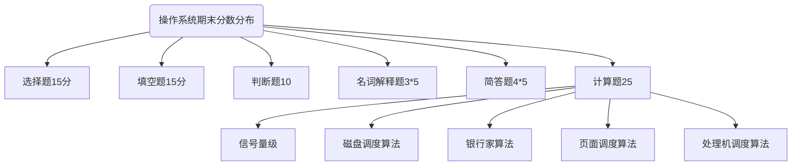

# 操作系统期末复习





## 第一章 操作系统引论
1. 操作系统的目标和作用
 - 目标：方便性，有效性，可扩充性，开放性
 - 作用：
    - OS作为用户与计算机硬件系统之间的接口
    - OS作为计算机系统资源的管理者
    - OS实现了对计算机资源的抽象
    - 管理工作流程
2. 操作系统的发展过程
    - 人工操作方式
    - 脱机输入/输出
    - 单道批处理系统
    - 多道批处理系统
    - 分时系统
    - 实时系统
    - 微机操作系统
3. 操作系统的基本特性
    - 并发
    - 共享
    - 虚拟
    - 异步
4. 操作系统的主要功能
    - 处理机管理
    - 存储器管理
    - 设备管理
    - 文件管理

## 第二章
1. 前驱图
2. 程序执行
    - 顺序执行
        - 顺序性
        - 封闭性
        - 可在现性
    - 并发执行 
        - 间断性
        - 失去封闭性
        - 不可再现性
3. PCB
    - 进程的定义：
        - 进程是进程实体的运行过程是操作系统进行资源分配和调度的一个独立单位
        - 是程序的一次执行
        - 是一个程序及其数据在处理机上顺序执行时发生的所有活动
        
    - 进程实体的组成部分：
        - 程序段
        - 数据段
        - PCB
        
    - PCB 
        - 进程标识符：
        - 内部标识符
        - 处理机状态
        - 进程调度信息
        - 进程控制信息
        
    - 进程控制块的组织方式：
    - 线性方式
        - 连接方式
        - 索引方式
    
- **操作系统提供的支撑功能**：**中断处理**，**时钟管理**，**原语操作**；
  
    - 进程的基本状态
		```mermaid
graph TB
D(("创建"))-->|"许可"|A
A(("就绪"))-->|"进程调度"|B((执行))
B-->|"时间片完"|A
B-->|"释放"|F(("终止"))
C(("阻塞"))-->|"I/O完成"|A
B-->|"I/O请求"|C
style D  fill:#f9f;
style F fill:#f9f;
    	```
    	
  - 更加复杂的图	
	```mermaid
graph TB
A(("创建"))
style A fill:#f9f;
A-->|"许可"|B(("活动就绪"))
A-->|"许可"|C(("静止就绪"))
B-->|"挂起"|C
C-->|"激活"|B
B-->|"调度"|D(("执行"))
D-->|"时间片用完"|B
D-->|"挂起"|C
style O fill:#f9F;
style D fill:#f9F;
E(("活动阻塞"))
F(("静止阻塞"))
E-->|"挂起"|F
F-->|"激活"|E
D-->|"I/O请求"|E
F-->|"释放"|C
E-->|"释放"|B
D-->|"释放"|O(("终止"))
  ```
  
  - 进程同步，对多个相关进程在执行次序上进行协调，使并发执行的进程之间能按照一定的规则（次序）共享系统资源，并且能够很好的相互合作，使得程序的执行具有可见性。
  
  - 信号量集 PV操作


## 第三章

1. 处理机调度的层次

   1. 高级调度（长程调度，作业调度），作业调度，将作业从外存调度到内存

      ```mermaid
      graph LR
      A(("外存"))-->|"作业"|B(("内存"))
      ```

   2. 低级调度（进程调度，短程调度）

      ```mermaid
      graph LR
      A(("内存"))-->|"进程"|B(("CPU"))
      ```

   3. 中级调度（内存调度）

      ```mermaid
      graph LR
      A(("内存"))-->|"进程"|B(("外存"))
      ```

   4. CPU利用率

      

      

      
      $$
      cpu利用率=\frac{cpu有效工作时间}{cpu有效工作时间+cpu空闲时间}
      $$

   

   

   

   

   5. 周转时间：作业从被提交给系统，，到作业完成为止的这一段时间，包括：在外存中的等待时间，在等待队列中的时间，cpu执行时间，等待IO时间

   6. 作业调度算法：

      - FIFO

      - SJF（短作业优先算法）

      - PSA（优先级调度算法）

        

        
        $$
        R_p=\frac{等待时间+要求服务时间}{要求服务时间}=\frac{响应时间}{要求服务时间}=1+\frac{等到时间}{要求服务时间}
        $$

      - RR(轮转调度算法)

   7. 死锁：

      - 产生的原因：

        1. 互斥  ，，资源排他
        2. 占有且等待，，占有一个了，同时还在请求其他资源
        3. 不可抢占条件，，资源不可被抢占
        4. 循环等待  ，， 发生死锁时必然存在一个请求某一个资源而等待的进程队列。

      - 处理方法：

        - 事前：

          - 预防

            - 破坏死锁产生的条件——“占有且等待”

              - 第一种协议：一次性分配资源给某个申请资源的进程。

              - 第二种协议：允许进程仅获得一部分必要资源便可开始执行。

            - 破坏死锁产生的条件——“不可抢占”

            - 破坏死锁产生的条件——“循环等待”

          - 避免

            - 安全状态——如果系统能够按照某种进程推进序列（P1，P2，P3.....，Pn）为每个进程Pi分配其所需资源，直至满足每个进程对资源的最大需求，使得每个进程都可以顺利的完成。称当前系统处于安全状态。序列（P1，P2，P3.....，Pn）为安全序列。
            - 银行家算法：（可以用递归求解），系统通过测试分配资源给某一个进程后系统是否处于安全状态，来作为系统进行资源分配依据，分配后若处于安全状态，则分配。

        - 事后

          - 解除
          - 检测


## 第四章

1. 存储器的层次
2. 程序的装入
   1. 绝对装入方式
   2. 可重定位装入方式
   3. 动态运行时装入
3. 程序的链接
   1. 静态链接
   2. 装入时动态链接
   3. 运行时动态链接
4. 连续分配存储管理方式
   1. 单一连续分配
   2. 固定分区分配
   3. 动态分区分配
   4. 基于顺序搜索的动态分区分配算法
      1. FF（首次适应）
      2. NF（循环首次适应）
      3. BF（最佳适应）
      4. WF(最坏适应)
   5. 分页技术和分段技术

## 第五章虚拟存储器

1. 虚拟内存的定义：具有请求调入功能和置换功能，能逻辑上对内存容量加以扩充的一种存储器系统。
2. 缺页率

$$
缺页率=\frac{缺页次数}{页面请求次数}
$$


1. 内存置换算法

   - 置换条件

     - 内存已满
     - 未命中

   - FIFO

   - 最佳置换算法（Optimal）往后看，越后被使用的越早被淘汰，同为永久未使用，页号越小越早被淘汰

   - 最久未使用置换算法（LRU） 往前看

     

     

     

     

     ## 第六章输入输出系统

     1. IO分类

        1. 速度，中   低    高
        2. 类型，字符设备   块设备

     2. 算法：

        1. FCFS

        2. SSTF（最短寻道时间）

           ​	可能会发生饥饿现象

        3. SCAN（扫描算法）

        4. CSCAN（循环扫描算法）

     

     

     

     **位示图**：提高读写效率，提高磁盘利用率

     